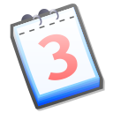

# Descripción

Agregación de calendarios de eventos FLOSS (Free Libre Open Source Software) de la zona de Galicia (España)

# Contenido

[](https://flossgalicia.github.io/calendarios/) <https://flossgalicia.github.io/calendarios/>

Actualmente están enlazados en el google calendar de `flossgalicia` los siguientes calendarios:

Grupo                 | Calendario
--------------------- | ------------------------------------------------------------------------------
**AgileVigo**         | webcal://www.meetup.com/es-ES/agile-vigo/events/ical/
**Codesign Project**  | webcal://www.meetup.com/es-ES/codesign-project/events/ical/
**GDG Vigo**          | webcal://www.meetup.com/es-ES/GDGVigo/events/ical/
**JavaScript Vigo**   | webcal://www.meetup.com/es-ES/JavaScriptVigo/events/ical/
**Joomla Vigo**       | webcal://www.meetup.com/es-ES/Grupo-de-Usuarios-de-Joomla-de-Vigo/events/ical/
**PHP Vigo**          | webcal://www.meetup.com/es-ES/PHPVigo/events/ical/
**Sysadmin@Galicia**  | webcal://www.meetup.com/es-ES/Sysadmin-Galicia/events/ical/
**Vigo JUG**          | webcal://www.meetup.com/es-ES/Vigo-JUG/events/ical/
**Vigo Labs**         | webcal://www.meetup.com/es-ES/Vigo-Labs/events/ical/
**Betabeers Galicia** | <https://betabeers.com/event/ical/?hashtag=bbgal>
**Pontevedra WordPress**         | webcal://www.meetup.com/es-ES/Pontevedra-WordPress-Meetup/events/ical/
**Rails Girls Galicia**          | webcal://www.meetup.com/es-ES/railsgirlsGAL/events/ical/
**WordPress Vigo**               | webcal://www.meetup.com/es-ES/Meetup-de-WordPress-en-Vigo/events/ical/
**GDG Ourense**                  | webcal://www.meetup.com/es-ES/gdgourense/events/ical/
**GDG Santiago**                 | webcal://www.meetup.com/es-ES/gdgsantiagoes/events/ical/
**XantarDev (Santiago)**         | webcal://www.meetup.com/es-ES/XantarDev/events/ical/
**Docker Galicia**               | webcal://www.meetup.com/es-ES/Docker-Galicia/events/ical/
**Virtual Reality Santiago**     | webcal://www.meetup.com/es-ES/Virtual-Reality-Santiago/events/ical/
**JavaScript Galicia (Ourense)** | webcal://www.meetup.com/es-ES/JavaScriptGalicia/events/ical/

No se han encontrado calendarios en formato ical, y se han añadido manualmente, de los siguientes grupos:

Grupo           | Calendario
--------------- | --------------------------------------------
**Python Vigo** | Tercer Jueves de cada mes, kaleido coworking

# Como contribuir

## Calendarios

Si eres el organizador de un grupo y tienes un calendario oficial del grupo en la red (En meetup, google calendar, ...) que quieras añadir, abre una issue indicando:

- Nombre del grupo: Para dar nombre al calendario.
- URL: Url del calendario en formato ICAL (U otro que acepte google calendar)

## Proyecto

Pull requests son más que bienvenidas.

Si quieres ser miembro de la organización o administrar directamente los calendarios, contacta conmigo [Daniel-at-github](https://github.com/Daniel-at-github)

# Como se hizo

Los pasos seguidos fueron:

- Crear infraestructura

  - Google Calendar <https://calendar.google.com>

    - Crear una cuenta
    - Añadir un calendario para las altas manuales de eventos
    - Añadir calendarios de red

  - Crear una organización en GitHub: <https://github.com/flossgalicia>

    - Crear este repositorio para los calendarios
    - Añadir `docs/index.html`
    - Configurar en `Settings` → `GitHub Pages` → `Source` → `master branch /docs folder`

- Añadir calendarios externos

  - Añadir los calendarios en google calendarios `Otros calendarios` → `Añadir por URL`
  - Obtener el código para incrustar el calendario:

    - En cualquier calendario entrar en `Configuración del calendario`
    - En `Incrustar este calendario` → `Personaliza el color, el tamaño y otras opciones`
    - En `Calendarios para mostrar` escoger el calendario a añadir
    - `Título del calendario` Floss Galicia
    - `La semana empieza el` Lunes
    - Copiar el iframe html generado

  - Escoger la parte del enlace y el color y añadir una nueva entrada en el fichero `docs/calendars.json`. Ej:

    ```json
    {
      "src": "g6mo7c6s7vv5g4r0ni0s2ranogltmam6%40import.calendar.google.com",
      "color": "23711616"
    },
    ```

  - Subir los cambios al repositorio

# Contenidos de terceros

- [Imagen de calendario](https://commons.wikimedia.org/wiki/Calendar#/media/File:Nuvola_apps_date.svg)
